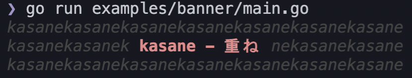

# kasane

String overlay library for Go



## Usage

```go
base := ".......\n.......\n.......\n.......\n......."
s := "xxx\nyyy\nzzz"

out := kasane.OverlayString(base, s, 1, 3)
fmt.Println(out)

// Output:
// .......
// ...xxx.
// ...yyy.
// ...zzz.
// .......
```

## License

MIT
